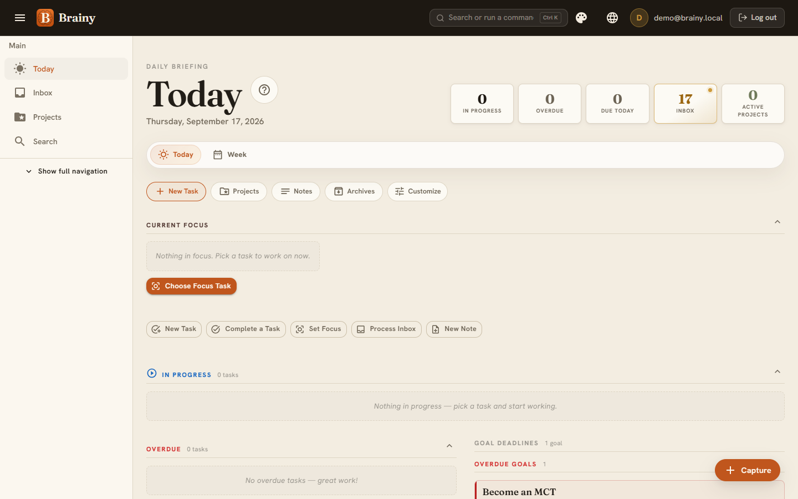
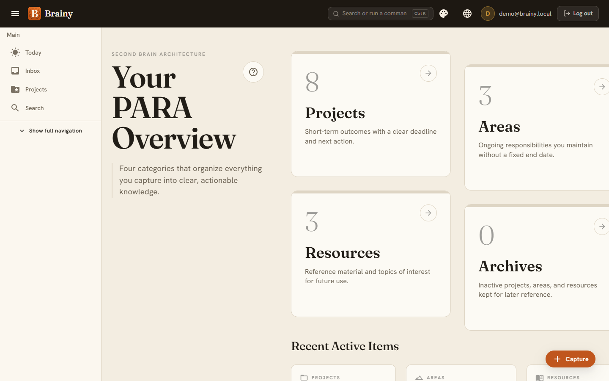
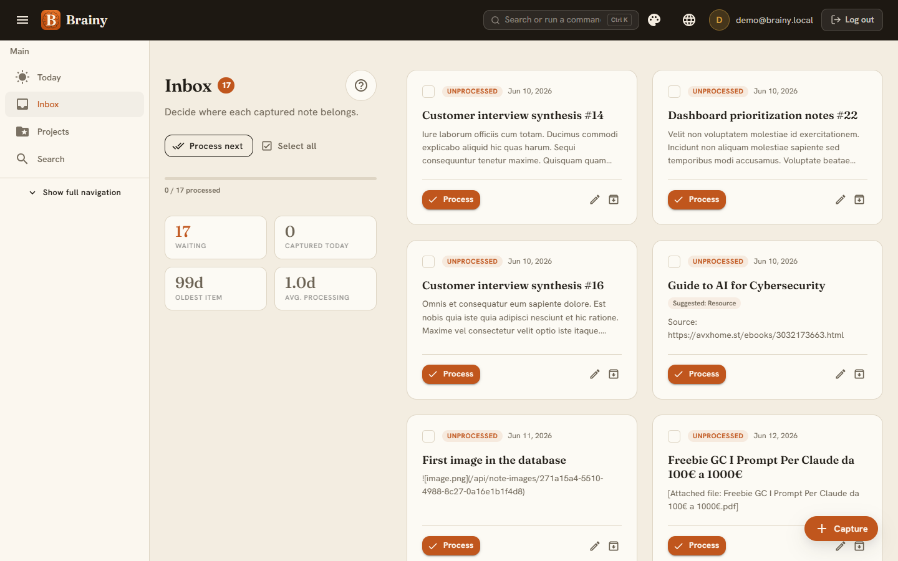
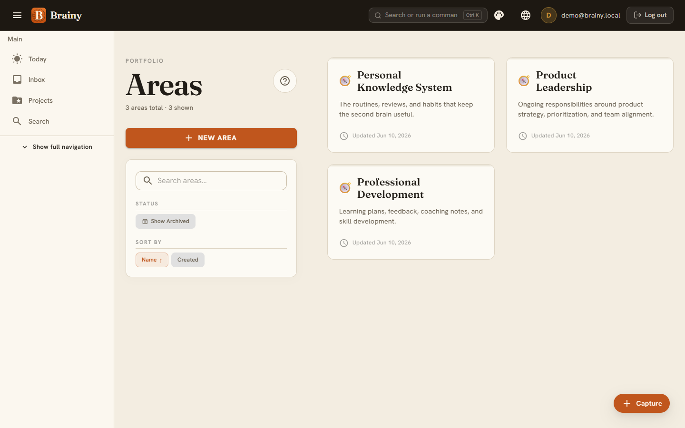
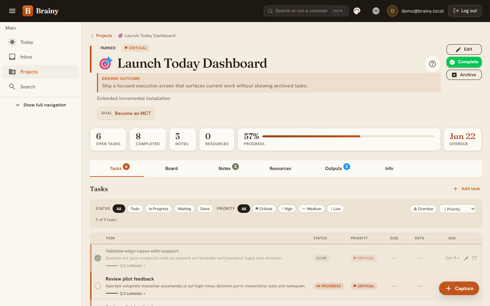
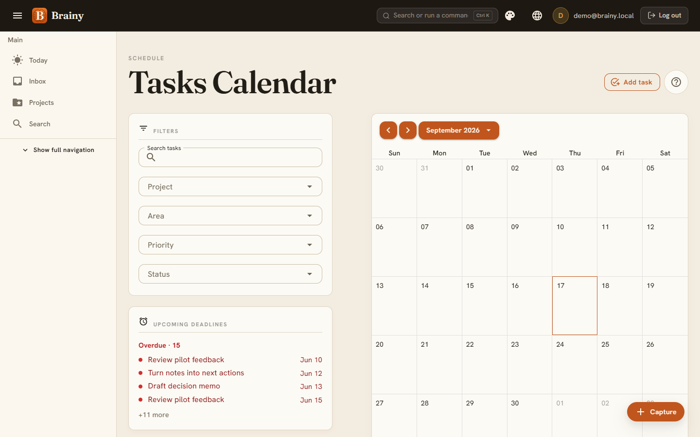
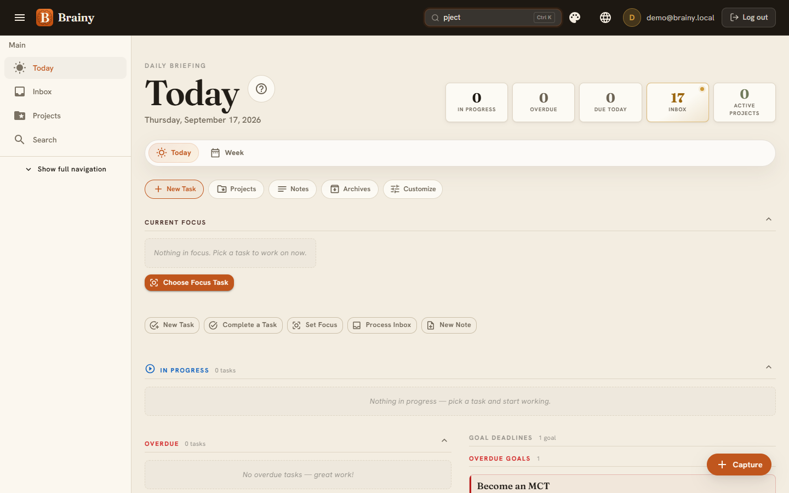
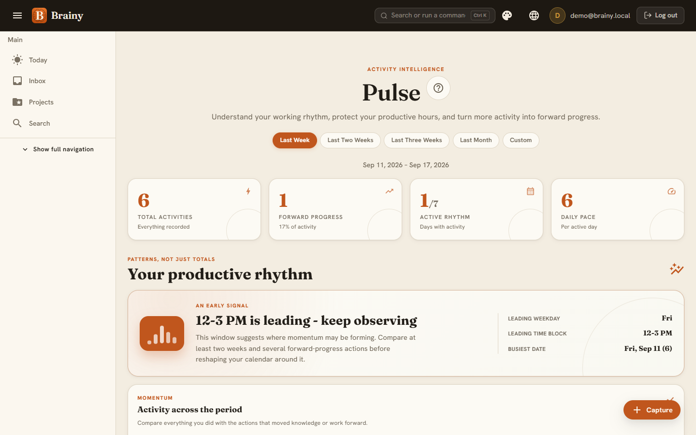
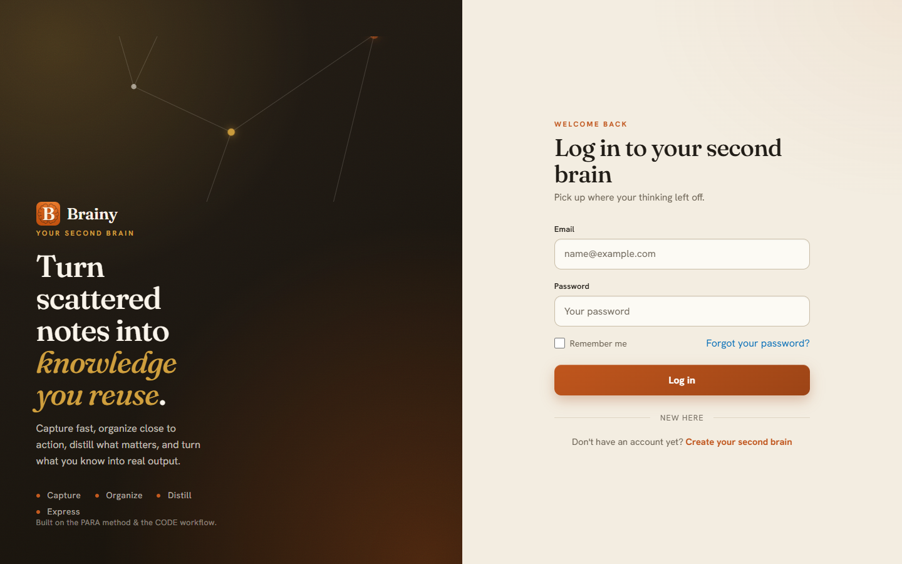

<div align="center">

# Brainy

**A practical second brain for turning scattered knowledge into useful work.**


[](LICENSE)

[Overview](#overview) | [Features](#features) | [Screenshots](#screenshots) | [Getting started](#getting-started) | [Development](#development) | [Contributing](#contributing)

</div>


## Overview

Brainy is an open source second-brain application built with .NET 10, Blazor, MudBlazor, Entity Framework Core, and SQL Server. It is inspired by Tiago Forte's PARA method and CODE workflow, with an emphasis on actionability rather than passive storage.

Capture notes and ideas, organize them into projects, areas, resources, and archives, then retrieve, summarize, and reuse that knowledge in real work.

> [!NOTE]
> AI assistant integration is implemented behind an application service boundary, but the default configuration disables AI features. Set an AI provider explicitly before using AI-assisted workflows.

## Hosted or self-hosted

Brainy is available as a hosted service at **[brainy-me.com](https://www.brainy-me.com)**, and it's also fully open source: you can run your own instance from this repository.

To self-host, you need a SQL Server database (see [Getting started](#getting-started)). Paid plans on the hosted service use Stripe, which is selected by `Billing:Provider`:

- `Development` configuration uses `Billing:Provider = None`: no payment provider is called and the entitlement system works without a Stripe account.
- The shipped `appsettings.json` also uses `Billing:Provider = None`, so a self-hosted production instance runs without any payment provider. The hosted service sets `Billing__Provider=Stripe` as an App Service application setting.
- To run your own Stripe billing, set `Billing__Provider=Stripe` plus the Stripe settings under `Billing` (the app refuses to start until they are all present).

AI features are disabled by default as well (see the note above).

## Features

- **Today dashboard** for current work, deadlines, overdue tasks, and project progress.
- **PARA organization** across projects, areas, resources, and archives.
- **Inbox processing** for captured notes and ideas that still need organization.
- **Notes and knowledge distillation** with highlights, summaries, sources, images, related-note relationships, and action-item promotion into project tasks.
- **Tasks and planning** with priorities, due dates, subtasks, recurring occurrences, archive/restore, project context, and prerequisite management with cycle protection.
- **Goals and milestones** for connecting longer-term outcomes to active projects.
- **Outputs** for turning stored knowledge into reusable Markdown deliverables, with preview, copy, download, and AI provenance.
- **Search and retrieval** across notes, outputs, projects, tasks, areas, resources, ideas, and goals.
- **Per-user data isolation** enforced through ASP.NET Core Identity and application services.
- **Data portability** through a versioned JSON export of the signed-in user's content and relationships.
- **Responsive Blazor UI** built with MudBlazor and interactive server rendering.

## Screenshots

<table>
<tr>
<td width="50%">

**Today dashboard**<br>
Daily briefing with in-progress, overdue, and due-today counts, current focus, and goal deadlines.


</td>
<td width="50%">

**PARA overview**<br>
Projects, areas, resources, and archives at a glance, with recent active items.


</td>
</tr>
<tr>
<td width="50%">

**Inbox processing**<br>
Triage captured notes with suggested categorization before they're organized.


</td>
<td width="50%">

**Areas**<br>
Ongoing responsibilities tracked independently of project deadlines.


</td>
</tr>
<tr>
<td width="50%">

**Project detail**<br>
Tasks, board, notes, resources, and outputs for a single project, with progress and deadlines.


</td>
<td width="50%">

**Tasks calendar**<br>
Month view of scheduled tasks with filters and upcoming deadlines.


</td>
</tr>
<tr>
<td width="50%">

**Command search**<br>
Jump to any note, task, project, or command from a single search palette.


</td>
<td width="50%">

**Pulse analytics**<br>
Activity intelligence that surfaces working rhythm and forward progress over time.


</td>
</tr>
<tr>
<td width="50%">

**Login**<br>
Sign-in screen for returning users.


</td>
<td width="50%">

</td>
</tr>
</table>

## Architecture

| Project | Responsibility |
| --- | --- |
| `Brainy.Domain` | Domain entities, enums, and shared domain contracts. |
| `Brainy.Application` | DTOs, service interfaces, business workflows, and AI abstractions. |
| `Brainy.Data` | Entity Framework Core context, SQL Server persistence, Identity, configurations, and migrations. |
| `Brainy.Web` | Blazor Web App, Interactive Server components, authentication endpoints, and the MudBlazor interface. |
| `Brainy.Application.Tests` | xUnit assertion tests for application services. |
| `Brainy.Web.Tests` | Security and public web-surface integration tests. |
| `Brainy.Data.IntegrationTests` | SQL Server migration, constraint, and rowversion tests. |

## Getting started

### Prerequisites

- [.NET 10 SDK](https://dotnet.microsoft.com/download)
- SQL Server, SQL Server Express, or LocalDB
- [Entity Framework Core CLI](https://learn.microsoft.com/ef/core/cli/dotnet) for manually managing migrations

### Configure the database

The development configuration uses LocalDB by default:

```json
{
  "ConnectionStrings": {
    "DefaultConnection": "Server=(localdb)\\MSSQLLocalDB;Database=Brainy;Trusted_Connection=True;MultipleActiveResultSets=true;TrustServerCertificate=true"
  }
}
```

Place overrides in `Brainy.Web/appsettings.Development.json`, User Secrets, or environment variables. Do not commit production credentials.

### Run locally

From the repository root:

```bash
dotnet run --project Brainy.Web
```

The development launch profiles use `http://localhost:5255` and `https://localhost:7107`.

Pending EF Core migrations are applied automatically when the application starts unless `Database:ApplyMigrationsOnStartup` is disabled. Local development enables `/Account/Register`; production registration is closed by default and must be deliberately enabled with `Identity:AllowRegistration`. Account confirmation is separately configurable through `Identity:RequireConfirmedAccount`.

## Development

### Build and test

```bash
dotnet restore
dotnet build
dotnet test
```

For release-style validation matching CI:

```bash
dotnet restore
dotnet build --no-restore --configuration Release
dotnet test --no-build --configuration Release --verbosity normal
```

### Database migrations

Create a migration from the repository root:

```bash
dotnet ef migrations add <MigrationName> --project Brainy.Data --startup-project Brainy.Web
```

Apply migrations manually:

```bash
dotnet ef database update --project Brainy.Data --startup-project Brainy.Web
```

Generate an idempotent SQL script for a controlled deployment:

```bash
dotnet ef migrations script --idempotent --project Brainy.Data --startup-project Brainy.Web --output migrations.sql
```

Startup migration is enabled by default in every environment. CI migrates a disposable SQL Server database to validate the schema, but it never modifies production. The production SQL endpoint is private, so migration currently occurs during application startup. Review every migration before release and use a dedicated private-network migration job when that infrastructure is available.

### Authentication and data ownership

Brainy uses ASP.NET Core Identity with cookie authentication. Principal entities such as `Note`, `Project`, `Area`, `Resource`, `Source`, `Output`, `Tag`, and `TaskItem` carry a required user relationship. Application services resolve the current user through `ICurrentUserService` and scope reads and writes to that user. Child records inherit ownership through their parent.

## Deployment

Merging to `main` only runs CI. The [Release workflow](.github/workflows/release.yml) ships to Azure App Service: it waits for CI to pass on the commit, builds once, deploys through the protected `production` environment with Azure OIDC, smoke tests `/health/ready`, and then tags and publishes the GitHub release.

```bash
gh workflow run release.yml -R kasuken/Brainy -f bump=minor      # patch | minor | major
gh workflow run release.yml -R kasuken/Brainy -f redeploy=v8.1.1 # roll back
```

The steps are shared with the other kasuken SaaS apps; see [RELEASING.md](https://github.com/kasuken/.github/blob/main/RELEASING.md).

`/health/live` and the backwards-compatible `/health` endpoint check the process only. `/health/ready` checks SQL connectivity and is used by deployment validation. See [`docs/production-runbook.md`](docs/production-runbook.md) for release, rollback, and recovery procedures.

## Resources

- [PARA method](https://fortelabs.com/blog/para/)
- [Progressive Summarization](https://fortelabs.com/blog/progressive-summarization-a-practical-technique-for-designing-better-summaries/)
- [.NET documentation](https://learn.microsoft.com/dotnet/)
- [Blazor documentation](https://learn.microsoft.com/aspnet/core/blazor/)
- [MudBlazor documentation](https://mudblazor.com/)
- [Entity Framework Core documentation](https://learn.microsoft.com/ef/core/)

## Contributing

Contributions are welcome! Please read the [contributing guidelines](https://github.com/kasuken/.github/blob/main/CONTRIBUTING.md) and the [Code of Conduct](https://github.com/kasuken/.github/blob/main/CODE_OF_CONDUCT.md) before opening a pull request. All contributors must sign the [Contributor License Agreement](https://github.com/kasuken/.github/blob/main/CLA.md); a bot will ask you to on your first pull request.

## Security

Please **do not** report security vulnerabilities in public issues. Use [private vulnerability reporting](https://github.com/kasuken/Brainy/security/advisories/new) instead. See the [Security Policy](https://github.com/kasuken/.github/blob/main/SECURITY.md) for details.

## License

Brainy is licensed under the [GNU Affero General Public License v3.0 only](LICENSE) (`AGPL-3.0-only`). If you run a modified version of Brainy as a network service, the AGPL requires you to make your modified source code available to its users. Set `SourceCodeUrl` in configuration to point the in-app "Source code" link at your repository.

Third-party components and their licenses are listed in [THIRD-PARTY-NOTICES.md](THIRD-PARTY-NOTICES.md).

"Brainy" and the Brainy logo are trademarks of Emanuele Bartolesi and are not licensed under the AGPL. If you publish a modified public instance, please use a different name and logo.
